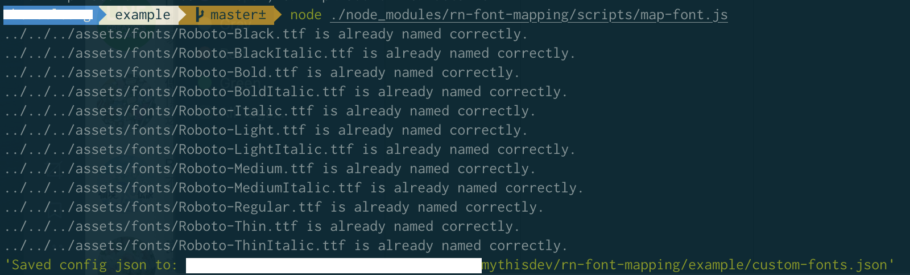
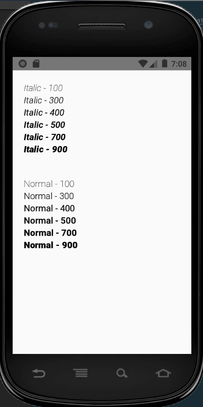

# rn-font-mapping
Mapping fontFamily with font weight and font style for custom fonts. 
iOS uses post-script name while android using file name.

### Installation
1. Add this package 
`yarn add rn-font-mapping`
2. prepare your fonts in `./assets/fonts`
3. Add a required package
`yarn add -D opentype.js`

### Usage
1. run the script to generate a mapping json `custom-fonts.json` at root folder
`node ./node_modules/rn-font-mapping/scripts/map-font.js`
[]

2. Use our Text component or map it with your own way.
```
import fontMapping from './custom-fonts.json';
import {Text as BaseText} from 'rn-font-mapping';

const Text = (props)=>{
  return <BaseText {...props} fontMapping={fontMapping} />
}
...

 <Text style={{
     fontFamily: 'Roboto',
    fontStyle: 'italic',
    fontWeight: weight
 }}>
    Hello world
</Text>
```

### Example Project
see `./example`

result: 
iOS:
[]

Android:
[]

